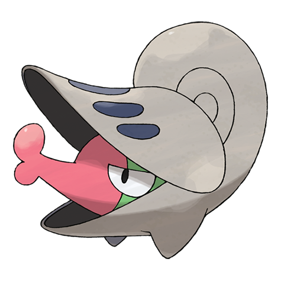

# Shelmet (#0616)

*Snail Pokemon*

**Type:** Insetto
**Abilities:** [[Hydration]], [[Shell Armor]], [[Overcoat]] *(Hidden)*
**Base HP:** 3

> When attacked, it defends itself by closing the lid of its shell or spits a sticky, poisonous liquid. It competes with Karrablast for food and shelter. If it loses its shell the distress may kill it, only those who survive evolve.

---

## Statistiche (Attributes & Limits)

| Attribute | Base / Limit |
|---|---|
| **Strength** | 1/3 |
| **Dexterity** | 1/3 |
| **Vitality** | 2/5 |
| **Special** | 1/3 |
| **Insight** | 2/4 |

---

## Mosse (Learnset)

- **Starter:** [[Leech_Life|Leech Life]]
- **Beginner:** [[Acid|Acid]], [[Bide|Bide]]
- **Amateur:** [[Curse|Curse]], [[Struggle_Bug|Struggle Bug]], [[Mega_Drain|Mega Drain]], [[Yawn|Yawn]], [[Protect|Protect]], [[Acid_Armor|Acid Armor]], [[Guard_Swap|Guard Swap]], [[Body_Slam|Body Slam]]
- **Ace:** [[Bug_Buzz|Bug Buzz]], [[Recover|Recover]], [[Giga_Drain|Giga Drain]], [[Final_Gambit|Final Gambit]]
- **Pro:** [[Guard_Split|Guard Split]], [[Gastro_Acid|Gastro Acid]], [[Endure|Endure]]

---

## Correlati

### Catena Evolutiva
- [[0616_Shelmet|Shelmet]]
- [[0617_Accelgor|Accelgor]]

