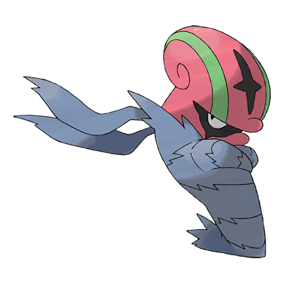

# Accelgor (#0617)

*Shell Out Pokemon*

**Type:** Insetto
**Abilities:** [[Hydration]], [[Sticky Hold]], [[Unburden]] *(Hidden)*
**Base HP:** 4

> Having removed its heavy shell, it becomes very light and swift. When its body dries out, it weakens. To prevent dehydration, it wraps itself in many layers of a thin membrane. It is very rare to see one in the wild.

---

## Statistiche (Attributes & Limits)

| Attribute | Base / Limit |
|---|---|
| **Strength** | 2/5 |
| **Dexterity** | 4/8 |
| **Vitality** | 1/3 |
| **Special** | 3/6 |
| **Insight** | 2/4 |

---

## Mosse (Learnset)

- **Starter:** [[Power_Swap|Power Swap]], [[Absorb|Absorb]]
- **Beginner:** [[Quick_Attack|Quick Attack]], [[Water_Shuriken|Water Shuriken]], [[Double_Team|Double Team]]
- **Amateur:** [[Acid_Spray|Acid Spray]], [[Struggle_Bug|Struggle Bug]], [[Mega_Drain|Mega Drain]], [[Swift|Swift]], [[Me_First|Me First]], [[Agility|Agility]], [[U_Turn|U-Turn]]
- **Ace:** [[Giga_Drain|Giga Drain]], [[Bug_Buzz|Bug Buzz]], [[Recover|Recover]], [[Final_Gambit|Final Gambit]]
- **Pro:** [[Baton_Pass|Baton Pass]], [[Feint|Feint]], [[Pursuit|Pursuit]]

---

## Correlati

### Catena Evolutiva
- [[0616_Shelmet|Shelmet]]
- [[0617_Accelgor|Accelgor]]

