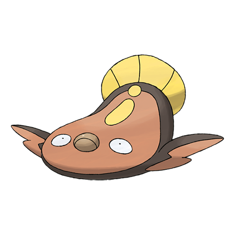

# Stunfisk (#0618)

*Trap Pokemon*

**Type:** Terra / Elettro
**Abilities:** [[Static]], [[Limber]], [[Sand Veil]] *(Hidden)*
**Base HP:** 5

> It conceals itself in the mud of the seashore, then it waits. When prey touch it, it delivers a jolt of electricity. Its skin is very hard and it can position itself to keep unhurt even if stepped on by a heavy Pokemon.

---

## Statistiche (Attributes & Limits)

| Attribute | Base / Limit |
|---|---|
| **Strength** | 2/4 |
| **Dexterity** | 1/3 |
| **Vitality** | 2/5 |
| **Special** | 2/5 |
| **Insight** | 3/6 |

---

## Mosse (Learnset)

- **Starter:** [[Tackle|Tackle]], [[Water_Gun|Water Gun]], [[Mud_Slap|Mud Slap]]
- **Beginner:** [[Mud_Sport|Mud Sport]], [[Bide|Bide]], [[Thunder_Shock|Thunder Shock]]
- **Amateur:** [[Mud_Shot|Mud Shot]], [[Camouflage|Camouflage]], [[Mud_Bomb|Mud Bomb]], [[Discharge|Discharge]], [[Endure|Endure]], [[Thunderbolt|Thunderbolt]], [[Muddy_Water|Muddy Water]]
- **Ace:** [[Bounce|Bounce]], [[Revenge|Revenge]], [[Flail|Flail]], [[Fissure|Fissure]]
- **Pro:** [[Eerie_Impulse|Eerie Impulse]], [[Curse|Curse]], [[Pain_Split|Pain Split]]

---

---

## Stunfisk (Forma Galar) (#0618G)

**Type:** Terra / Acciaio
**Abilities:** [[Mimicry]]
**Base HP:** 4

| Attribute | Base / Limit |
|---|---|
| **Strength** | 2/5 |
| **Dexterity** | 1/3 |
| **Vitality** | 3/6 |
| **Special** | 2/4 |
| **Insight** | 2/5 |

### Mosse

- **Starter:** [[Tackle|Tackle]], [[Mud_Slap|Mud Slap]]
- **Beginner:** [[Water_Gun|Water Gun]], [[Metal_Claw|Metal Claw]], [[Endure|Endure]]
- **Amateur:** [[Mud_Shot|Mud Shot]], [[Revenge|Revenge]], [[Metal_Sound|Metal Sound]], [[Sucker_Punch|Sucker Punch]], [[Iron_Defense|Iron Defense]], [[Bounce|Bounce]], [[Muddy_Water|Muddy Water]]
- **Ace:** [[Snap_Trap|Snap Trap]], [[Flail|Flail]], [[Fissure|Fissure]]
- **Pro:** [[Stealth_Rock|Stealth Rock]], [[Bind|Bind]], [[Counter|Counter]]

