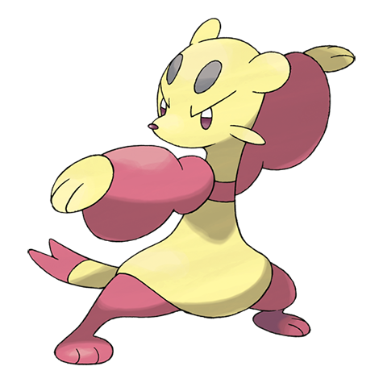

# Mienfoo (#0619)

*Martial Arts Pokemon*

**Type:** Lotta
**Abilities:** [[Inner Focus]], [[Regenerator]], [[Reckless]] *(Hidden)*
**Base HP:** 3

> They gather in small groups around the mountains to train and master new techniques. They use their sharp claws to damage their foes. Only those Mienfoo that excel at fighting in the group evolve.

---

## Statistiche (Attributes & Limits)

| Attribute | Base / Limit |
|---|---|
| **Strength** | 2/5 |
| **Dexterity** | 2/4 |
| **Vitality** | 2/4 |
| **Special** | 2/4 |
| **Insight** | 2/4 |

---

## Mosse (Learnset)

- **Starter:** [[Pound|Pound]]
- **Beginner:** [[Meditate|Meditate]], [[Detect|Detect]]
- **Amateur:** [[Fake_Out|Fake Out]], [[Double_Slap|Double Slap]], [[Swift|Swift]], [[Calm_Mind|Calm Mind]], [[Force_Palm|Force Palm]], [[Drain_Punch|Drain Punch]], [[Jump_Kick|Jump Kick]], [[U_Turn|U-Turn]]
- **Ace:** [[Quick_Guard|Quick Guard]], [[Bounce|Bounce]], [[High_Jump_Kick|High Jump Kick]], [[Reversal|Reversal]], [[Aura_Sphere|Aura Sphere]]
- **Pro:** [[Ally_Switch|Ally Switch]], [[Feint|Feint]], [[Endure|Endure]]

---

## Correlati

### Catena Evolutiva
- [[0619_Mienfoo|Mienfoo]]
- [[0620_Mienshao|Mienshao]]

