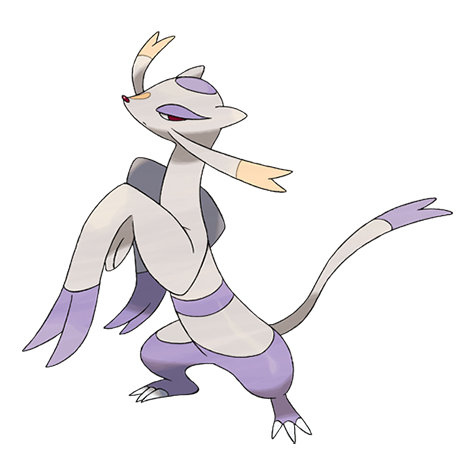

# Mienshao (#0620)

*Martial Arts Pokemon*

**Type:** Lotta
**Abilities:** [[Inner Focus]], [[Regenerator]], [[Reckless]] *(Hidden)*
**Base HP:** 4

> By the time they evolve they already have many years of experience in fighting. They use the long fur on their arms as a whip to strike their opponents and will not stop until the foe is defeated.

---

## Statistiche (Attributes & Limits)

| Attribute | Base / Limit |
|---|---|
| **Strength** | 3/7 |
| **Dexterity** | 3/6 |
| **Vitality** | 2/4 |
| **Special** | 3/6 |
| **Insight** | 2/4 |

---

## Mosse (Learnset)

- **Starter:** [[Pound|Pound]]
- **Beginner:** [[Meditate|Meditate]], [[Detect|Detect]]
- **Amateur:** [[Fake_Out|Fake Out]], [[Double_Slap|Double Slap]], [[Swift|Swift]], [[Calm_Mind|Calm Mind]], [[Force_Palm|Force Palm]], [[Drain_Punch|Drain Punch]], [[Jump_Kick|Jump Kick]], [[U_Turn|U-Turn]]
- **Ace:** [[Wide_Guard|Wide Guard]], [[Bounce|Bounce]], [[High_Jump_Kick|High Jump Kick]], [[Reversal|Reversal]], [[Aura_Sphere|Aura Sphere]]
- **Pro:** [[Dual_Chop|Dual Chop]], [[Helping_Hand|Helping Hand]], [[Endure|Endure]]

---

## Correlati

### Catena Evolutiva
- [[0619_Mienfoo|Mienfoo]]
- [[0620_Mienshao|Mienshao]]

