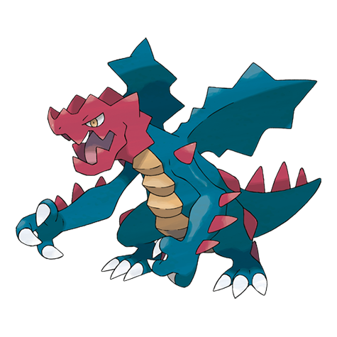

# Druddigon (#0621)

*Cave Pokemon*

**Type:** Drago
**Abilities:** [[Rough Skin]], [[Sheer Force]], [[Mold Breaker]] *(Hidden)*
**Base HP:** 4

> It runs through the narrow tunnels dug by Excadrill and Onix and uses its sharp claws to catch prey. It is cold blooded, and regularly takes sun baths to keep its energy. They are aggressive and territorial.

---

## Statistiche (Attributes & Limits)

| Attribute | Base / Limit |
|---|---|
| **Strength** | 3/7 |
| **Dexterity** | 2/5 |
| **Vitality** | 2/4 |
| **Special** | 2/4 |
| **Insight** | 2/5 |

---

## Mosse (Learnset)

- **Starter:** [[Scratch|Scratch]], [[Leer|Leer]]
- **Beginner:** [[Hone_Claws|Hone Claws]], [[Bite|Bite]]
- **Amateur:** [[Scary_Face|Scary Face]], [[Dragon_Rage|Dragon Rage]], [[Slash|Slash]], [[Crunch|Crunch]], [[Dragon_Claw|Dragon Claw]], [[Chip_Away|Chip Away]], [[Revenge|Revenge]], [[Night_Slash|Night Slash]]
- **Ace:** [[Dragon_Tail|Dragon Tail]], [[Rock_Climb|Rock Climb]], [[Superpower|Superpower]], [[Outrage|Outrage]]
- **Pro:** [[Fire_Fang|Fire Fang]], [[Thunder_Fang|Thunder Fang]], [[Poison_Tail|Poison Tail]]

---

