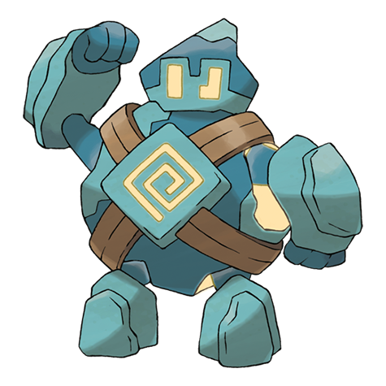

# Golett (#0622)

*Automaton Pokemon*

**Type:** Terra / Spettro
**Abilities:** [[Iron Fist]], [[Klutz]], [[No Guard]] *(Hidden)*
**Base HP:** 3

> Very few have been seen in old ruins. These Pokemon are thought to have been created by the science of an ancient and mysterious civilization. The energy inside of it comes from an unknown source.

---

## Statistiche (Attributes & Limits)

| Attribute | Base / Limit |
|---|---|
| **Strength** | 2/5 |
| **Dexterity** | 1/3 |
| **Vitality** | 2/4 |
| **Special** | 1/3 |
| **Insight** | 2/5 |

---

## Mosse (Learnset)

- **Starter:** [[Pound|Pound]], [[Astonish|Astonish]]
- **Beginner:** [[Defense_Curl|Defense Curl]], [[Mud_Slap|Mud Slap]], [[Rollout|Rollout]]
- **Amateur:** [[Shadow_Punch|Shadow Punch]], [[Iron_Defense|Iron Defense]], [[Mega_Punch|Mega Punch]], [[Stomping_Tantrum|Stomping Tantrum]], [[Magnitude|Magnitude]], [[Dynamic_Punch|Dynamic Punch]], [[Night_Shade|Night Shade]]
- **Ace:** [[Curse|Curse]], [[Earthquake|Earthquake]], [[Hammer_Arm|Hammer Arm]], [[Focus_Punch|Focus Punch]]
- **Pro:** [[Fire_Punch|Fire Punch]], [[Thunder_Punch|Thunder Punch]], [[Ice_Punch|Ice Punch]]

---

## Correlati

### Catena Evolutiva
- [[0622_Golett|Golett]]
- [[0623_Golurk|Golurk]]

