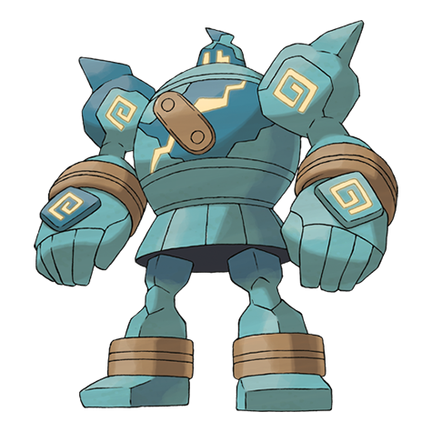

# Golurk (#0623)

*Automaton Pokemon*

**Type:** Terra / Spettro
**Abilities:** [[Iron Fist]], [[Klutz]], [[No Guard]] *(Hidden)*
**Base HP:** 4

> It is said that Golurk were ordered to protect people and Pokemon by the ancient people who created them. There are records of only one still alive found on the ruin, the rest are just statues now.

---

## Statistiche (Attributes & Limits)

| Attribute | Base / Limit |
|---|---|
| **Strength** | 3/7 |
| **Dexterity** | 2/4 |
| **Vitality** | 2/5 |
| **Special** | 2/4 |
| **Insight** | 2/5 |

---

## Mosse (Learnset)

- **Starter:** [[Pound|Pound]], [[Astonish|Astonish]]
- **Beginner:** [[Defense_Curl|Defense Curl]], [[Mud_Slap|Mud Slap]], [[Rollout|Rollout]]
- **Amateur:** [[Shadow_Punch|Shadow Punch]], [[Iron_Defense|Iron Defense]], [[Mega_Punch|Mega Punch]], [[Stomping_Tantrum|Stomping Tantrum]], [[Magnitude|Magnitude]], [[Dynamic_Punch|Dynamic Punch]], [[Night_Shade|Night Shade]], [[Curse|Curse]]
- **Ace:** [[Phantom_Force|Phantom Force]], [[High_Horsepower|High Horsepower]], [[Heavy_Slam|Heavy Slam]], [[Earthquake|Earthquake]], [[Hammer_Arm|Hammer Arm]], [[Focus_Punch|Focus Punch]]
- **Pro:** [[Block|Block]], [[Zen_Headbutt|Zen Headbutt]], [[Drain_Punch|Drain Punch]]

---

## Correlati

### Catena Evolutiva
- [[0622_Golett|Golett]]
- [[0623_Golurk|Golurk]]

