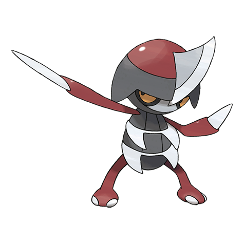

# Pawniard (#0624)

*Sharp Blade Pokemon*

**Type:** Buio / Acciaio
**Abilities:** [[Defiant]], [[Inner Focus]], [[Pressure]] *(Hidden)*
**Base HP:** 3

> They live in groups commanded by Bisharp. They cling to their prey and inflict damage by sinking their blades. If battling dulls the blades, it sharpens them on stones by the river. It takes them years to evolve.

---

## Statistiche (Attributes & Limits)

| Attribute | Base / Limit |
|---|---|
| **Strength** | 2/5 |
| **Dexterity** | 2/4 |
| **Vitality** | 2/5 |
| **Special** | 1/3 |
| **Insight** | 1/3 |

---

## Mosse (Learnset)

- **Starter:** [[Scratch|Scratch]], [[Leer|Leer]]
- **Beginner:** [[Fury_Cutter|Fury Cutter]]
- **Amateur:** [[Torment|Torment]], [[Feint_Attack|Feint Attack]], [[Scary_Face|Scary Face]], [[Metal_Claw|Metal Claw]], [[Slash|Slash]], [[Assurance|Assurance]], [[Metal_Sound|Metal Sound]], [[Embargo|Embargo]], [[Iron_Defense|Iron Defense]]
- **Ace:** [[Night_Slash|Night Slash]], [[Iron_Head|Iron Head]], [[Swords_Dance|Swords Dance]], [[Guillotine|Guillotine]]
- **Pro:** [[Sucker_Punch|Sucker Punch]], [[Mean_Look|Mean Look]], [[Quick_Guard|Quick Guard]]

---

## Correlati

### Catena Evolutiva
- [[0624_Pawniard|Pawniard]]
- [[0625_Bisharp|Bisharp]]

