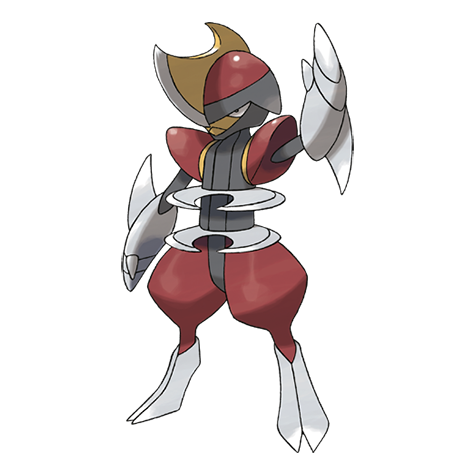

# Bisharp (#0625)

*Sword Blade Pokemon*

**Type:** Buio / Acciaio
**Abilities:** [[Defiant]], [[Inner Focus]], [[Pressure]] *(Hidden)*
**Base HP:** 4

> It leads a group of Pawniard. It battles to become the boss, but will be driven from the group if it loses. They are ruthless leaders and merciless with their foes. Weakness has no place among them.

---

## Statistiche (Attributes & Limits)

| Attribute | Base / Limit |
|---|---|
| **Strength** | 3/7 |
| **Dexterity** | 2/5 |
| **Vitality** | 3/6 |
| **Special** | 2/4 |
| **Insight** | 2/5 |

---

## Mosse (Learnset)

- **Starter:** [[Scratch|Scratch]], [[Leer|Leer]]
- **Beginner:** [[Fury_Cutter|Fury Cutter]]
- **Amateur:** [[Torment|Torment]], [[Feint_Attack|Feint Attack]], [[Scary_Face|Scary Face]], [[Metal_Claw|Metal Claw]], [[Slash|Slash]], [[Assurance|Assurance]], [[Metal_Sound|Metal Sound]], [[Embargo|Embargo]], [[Iron_Defense|Iron Defense]]
- **Ace:** [[Guillotine|Guillotine]], [[Metal_Burst|Metal Burst]], [[Night_Slash|Night Slash]], [[Iron_Head|Iron Head]], [[Swords_Dance|Swords Dance]]
- **Pro:** [[Dual_Chop|Dual Chop]], [[Psycho_Cut|Psycho Cut]], [[Low_Kick|Low Kick]]

---

## Correlati

### Catena Evolutiva
- [[0624_Pawniard|Pawniard]]
- [[0625_Bisharp|Bisharp]]

