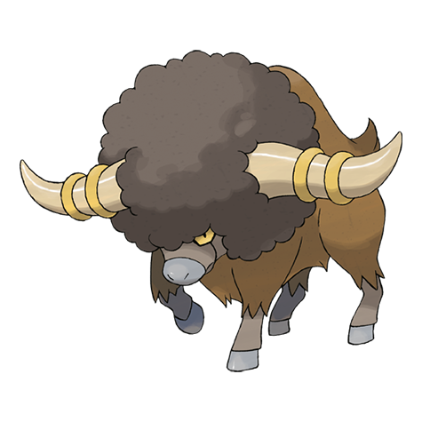

# Bouffalant (#0626)

*Bash Buffalo Pokemon*

**Type:** Normale
**Abilities:** [[Reckless]], [[Sap Sipper]], [[Soundproof]] *(Hidden)*
**Base HP:** 4

> They form herds on the coldest plains. They bash and headbutt to attack their foes. The fluffy fur on their heads absorbs damage to their skulls. Years ago, a Bouffalant derailed a train with a bash.

---

## Statistiche (Attributes & Limits)

| Attribute | Base / Limit |
|---|---|
| **Strength** | 3/6 |
| **Dexterity** | 2/4 |
| **Vitality** | 3/6 |
| **Special** | 1/3 |
| **Insight** | 3/6 |

---

## Mosse (Learnset)

- **Starter:** [[Pursuit|Pursuit]], [[Leer|Leer]]
- **Beginner:** [[Rage|Rage]], [[Fury_Attack|Fury Attack]]
- **Amateur:** [[Horn_Attack|Horn Attack]], [[Scary_Face|Scary Face]], [[Revenge|Revenge]], [[Head_Charge|Head Charge]], [[Focus_Energy|Focus Energy]], [[Reversal|Reversal]]
- **Ace:** [[Megahorn|Megahorn]], [[Thrash|Thrash]], [[Swords_Dance|Swords Dance]], [[Giga_Impact|Giga Impact]]
- **Pro:** [[Skull_Bash|Skull Bash]], [[Zen_Headbutt|Zen Headbutt]], [[Outrage|Outrage]]

---

