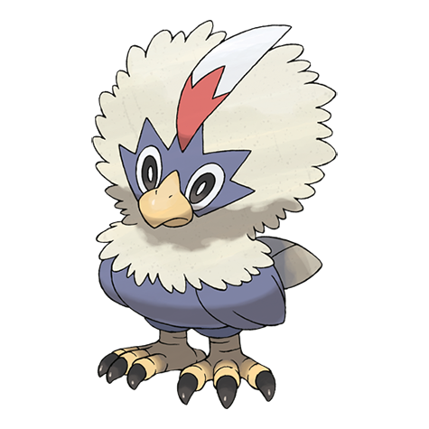

# Rufflet (#0627)

*Eaglet Pokemon*

**Type:** Normale / Volante
**Abilities:** [[Keen Eye]], [[Sheer Force]], [[Hustle]] *(Hidden)*
**Base HP:** 3

> This species only has males. They are independent from the moment they hatch. They will challenge even strong opponents, without fear. Their frequent fights help them become stronger.

---

## Statistiche (Attributes & Limits)

| Attribute | Base / Limit |
|---|---|
| **Strength** | 2/5 |
| **Dexterity** | 2/4 |
| **Vitality** | 2/4 |
| **Special** | 1/3 |
| **Insight** | 2/4 |

---

## Mosse (Learnset)

- **Starter:** [[Peck|Peck]], [[Leer|Leer]]
- **Beginner:** [[Fury_Attack|Fury Attack]], [[Wing_Attack|Wing Attack]]
- **Amateur:** [[Hone_Claws|Hone Claws]], [[Scary_Face|Scary Face]], [[Aerial_Ace|Aerial Ace]], [[Slash|Slash]], [[Defog|Defog]], [[Tailwind|Tailwind]], [[Air_Slash|Air Slash]], [[Crush_Claw|Crush Claw]]
- **Ace:** [[Sky_Drop|Sky Drop]], [[Whirlwind|Whirlwind]], [[Brave_Bird|Brave Bird]], [[Thrash|Thrash]]
- **Pro:** [[Pluck|Pluck]], [[Superpower|Superpower]], [[Heat_Wave|Heat Wave]]

---

## Correlati

### Catena Evolutiva
- [[0627_Rufflet|Rufflet]]
- [[0628_Braviary|Braviary]]

