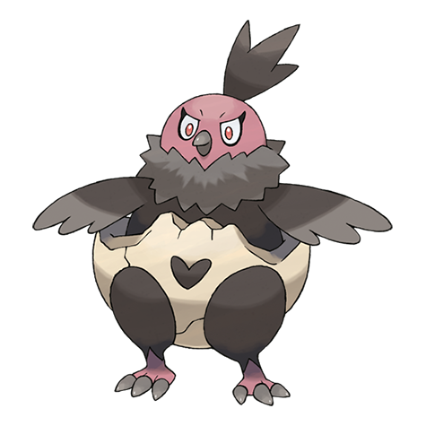

# Vullaby (#0629)

*Diapered Pokemon*

**Type:** Buio / Volante
**Abilities:** [[Big Pecks]], [[Overcoat]], [[Weak Armor]] *(Hidden)*
**Base HP:** 3

> This is a female-only species. They stay with their Mandibuzz mothers from birth until they can finally fly. They feed on the carrion meat the mothers bring back to the nest and keep the bones to make accessories.

---

## Statistiche (Attributes & Limits)

| Attribute | Base / Limit |
|---|---|
| **Strength** | 2/4 |
| **Dexterity** | 2/4 |
| **Vitality** | 2/5 |
| **Special** | 2/4 |
| **Insight** | 2/5 |

---

## Mosse (Learnset)

- **Starter:** [[Gust|Gust]], [[Leer|Leer]]
- **Beginner:** [[Fury_Attack|Fury Attack]], [[Pluck|Pluck]]
- **Amateur:** [[Nasty_Plot|Nasty Plot]], [[Flatter|Flatter]], [[Feint_Attack|Feint Attack]], [[Punishment|Punishment]], [[Defog|Defog]], [[Tailwind|Tailwind]], [[Air_Slash|Air Slash]], [[Dark_Pulse|Dark Pulse]]
- **Ace:** [[Embargo|Embargo]], [[Whirlwind|Whirlwind]], [[Brave_Bird|Brave Bird]], [[Mirror_Move|Mirror Move]]
- **Pro:** [[Scary_Face|Scary Face]], [[Fake_Tears|Fake Tears]], [[Iron_Defense|Iron Defense]]

---

## Correlati

### Catena Evolutiva
- [[0629_Vullaby|Vullaby]]
- [[0630_Mandibuzz|Mandibuzz]]

