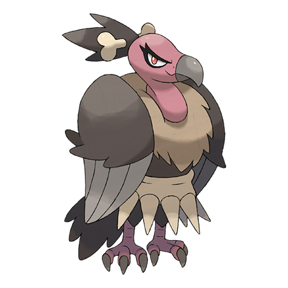

# Mandibuzz (#0630)

*Bone Vulture Pokemon*

**Type:** Buio / Volante
**Abilities:** [[Big Pecks]], [[Overcoat]], [[Weak Armor]] *(Hidden)*
**Base HP:** 5

> They fly in circles around the sky when they spot prey. They carry the carcass back to their nest with ease. They like to look beautiful and create ornaments and jewelry using bone pieces.

---

## Statistiche (Attributes & Limits)

| Attribute | Base / Limit |
|---|---|
| **Strength** | 2/4 |
| **Dexterity** | 2/5 |
| **Vitality** | 3/6 |
| **Special** | 2/4 |
| **Insight** | 3/6 |

---

## Mosse (Learnset)

- **Starter:** [[Gust|Gust]], [[Leer|Leer]]
- **Beginner:** [[Fury_Attack|Fury Attack]], [[Pluck|Pluck]]
- **Amateur:** [[Nasty_Plot|Nasty Plot]], [[Flatter|Flatter]], [[Feint_Attack|Feint Attack]], [[Punishment|Punishment]], [[Defog|Defog]], [[Tailwind|Tailwind]], [[Air_Slash|Air Slash]], [[Dark_Pulse|Dark Pulse]], [[Bone_Rush|Bone Rush]]
- **Ace:** [[Mirror_Move|Mirror Move]], [[Embargo|Embargo]], [[Whirlwind|Whirlwind]], [[Brave_Bird|Brave Bird]]
- **Pro:** [[Scary_Face|Scary Face]], [[Fake_Tears|Fake Tears]], [[Iron_Defense|Iron Defense]]

---

## Correlati

### Catena Evolutiva
- [[0629_Vullaby|Vullaby]]
- [[0630_Mandibuzz|Mandibuzz]]

