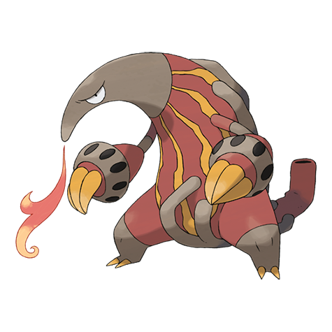

# Heatmor (#0631)

*Anteater Pokemon*

**Type:** Fuoco
**Abilities:** [[Gluttony]], [[Flash Fire]], [[White Smoke]] *(Hidden)*
**Base HP:** 4

> It draws in air through its tail, then transforms it into fire and uses it like a tongue. You can see them defending Durant’s colonies from predators so they can be the only ones who can eat them.

---

## Statistiche (Attributes & Limits)

| Attribute | Base / Limit |
|---|---|
| **Strength** | 3/6 |
| **Dexterity** | 2/5 |
| **Vitality** | 2/4 |
| **Special** | 3/6 |
| **Insight** | 2/4 |

---

## Mosse (Learnset)

- **Starter:** [[Tackle|Tackle]], [[Odor_Sleuth|Odor Sleuth]], [[Lick|Lick]]
- **Beginner:** [[Incinerate|Incinerate]], [[Hone_Claws|Hone Claws]], [[Bind|Bind]]
- **Amateur:** [[Fire_Spin|Fire Spin]], [[Fury_Swipes|Fury Swipes]], [[Snatch|Snatch]], [[Flame_Burst|Flame Burst]], [[Bug_Bite|Bug Bite]], [[Slash|Slash]], [[Amnesia|Amnesia]], [[Fire_Lash|Fire Lash]], [[Flamethrower|Flamethrower]]
- **Ace:** [[Stockpile|Stockpile]], [[Swallow|Swallow]], [[Spit_Up|Spit Up]], [[Inferno|Inferno]], [[Flare_Blitz|Flare Blitz]]
- **Pro:** [[Thunder_Punch|Thunder Punch]], [[Fire_Punch|Fire Punch]], [[Night_Slash|Night Slash]]

---

