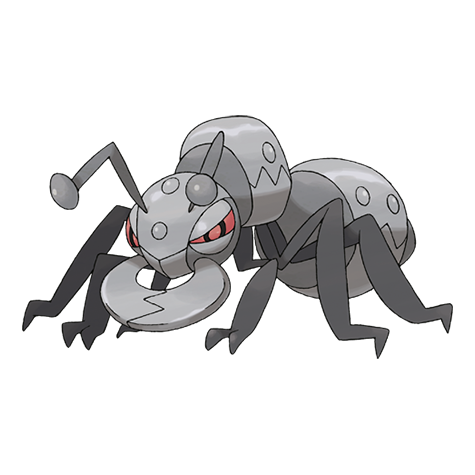

# Durant (#0632)

*Iron Ant Pokemon*

**Type:** Insetto / Acciaio
**Abilities:** [[Swarm]], [[Hustle]], [[Truant]] *(Hidden)*
**Base HP:** 4

> Durant build complex mazes of tunnels in the mountains. Each colony has hundreds of Durant, all playing different roles in driving Heatmor away from their nest as it is their only predator.

---

## Statistiche (Attributes & Limits)

| Attribute | Base / Limit |
|---|---|
| **Strength** | 3/6 |
| **Dexterity** | 3/6 |
| **Vitality** | 3/6 |
| **Special** | 2/4 |
| **Insight** | 2/4 |

---

## Mosse (Learnset)

- **Starter:** [[Sand_Attack|Sand Attack]], [[Vice_Grip|Vice Grip]]
- **Beginner:** [[Bite|Bite]], [[Fury_Cutter|Fury Cutter]]
- **Amateur:** [[Metal_Sound|Metal Sound]], [[Agility|Agility]], [[Metal_Claw|Metal Claw]], [[Bug_Bite|Bug Bite]], [[Crunch|Crunch]], [[Iron_Head|Iron Head]], [[Dig|Dig]]
- **Ace:** [[Entrainment|Entrainment]], [[X_Scissor|X-Scissor]], [[Iron_Defense|Iron Defense]], [[Guillotine|Guillotine]]
- **Pro:** [[Screech|Screech]], [[Thunder_Fang|Thunder Fang]], [[Superpower|Superpower]]

---

