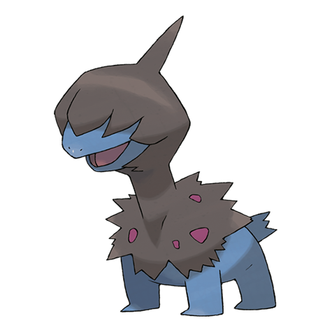

# Deino (#0633)

*Irate Pokemon*

**Type:** Buio / Drago
**Abilities:** [[Hustle]]
**Base HP:** 3

> This Pokemon is blind, It bites all it finds to be aware of its surroundings. It constantly bumps into things and attacks anything close to it. Their bodies are covered in wounds and they are very aggressive.

---

## Statistiche (Attributes & Limits)

| Attribute | Base / Limit |
|---|---|
| **Strength** | 2/4 |
| **Dexterity** | 1/3 |
| **Vitality** | 2/4 |
| **Special** | 2/4 |
| **Insight** | 2/4 |

---

## Mosse (Learnset)

- **Starter:** [[Tackle|Tackle]], [[Dragon_Rage|Dragon Rage]]
- **Beginner:** [[Focus_Energy|Focus Energy]], [[Bite|Bite]]
- **Amateur:** [[Headbutt|Headbutt]], [[Dragon_Breath|Dragon Breath]], [[Roar|Roar]], [[Crunch|Crunch]], [[Slam|Slam]], [[Dragon_Pulse|Dragon Pulse]], [[Work_Up|Work Up]], [[Dragon_Rush|Dragon Rush]], [[Body_Slam|Body Slam]]
- **Ace:** [[Scary_Face|Scary Face]], [[Hyper_Voice|Hyper Voice]], [[Outrage|Outrage]]
- **Pro:** [[Head_Smash|Head Smash]], [[Thunder_Fang|Thunder Fang]], [[Fire_Fang|Fire Fang]]

---

## Correlati

### Catena Evolutiva
- [[0633_Deino|Deino]]
- [[0634_Zweilous|Zweilous]]
- [[0635_Hydreigon|Hydreigon]]

