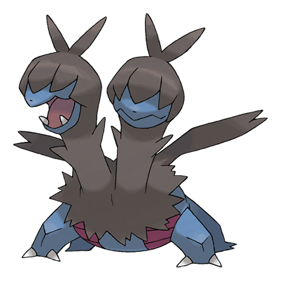

# Zweilous (#0634)

*Hostile Pokemon*

**Type:** Buio / Drago
**Abilities:** [[Hustle]]
**Base HP:** 4

> The two heads do not get along with each other as they compete for food. For this reason , Zweilous usually eats more than it should. Touching it carelessly can get you attacked by one or both heads.

---

## Statistiche (Attributes & Limits)

| Attribute | Base / Limit |
|---|---|
| **Strength** | 2/5 |
| **Dexterity** | 2/4 |
| **Vitality** | 2/5 |
| **Special** | 2/4 |
| **Insight** | 2/5 |

---

## Mosse (Learnset)

- **Starter:** [[Double_Hit|Double Hit]], [[Dragon_Rage|Dragon Rage]]
- **Beginner:** [[Focus_Energy|Focus Energy]], [[Bite|Bite]]
- **Amateur:** [[Headbutt|Headbutt]], [[Dragon_Breath|Dragon Breath]], [[Roar|Roar]], [[Crunch|Crunch]], [[Slam|Slam]], [[Dragon_Pulse|Dragon Pulse]], [[Work_Up|Work Up]], [[Dragon_Rush|Dragon Rush]], [[Body_Slam|Body Slam]]
- **Ace:** [[Scary_Face|Scary Face]], [[Hyper_Voice|Hyper Voice]], [[Outrage|Outrage]]
- **Pro:** [[Head_Smash|Head Smash]], [[Thunder_Fang|Thunder Fang]], [[Fire_Fang|Fire Fang]]

---

## Correlati

### Catena Evolutiva
- [[0633_Deino|Deino]]
- [[0634_Zweilous|Zweilous]]
- [[0635_Hydreigon|Hydreigon]]

