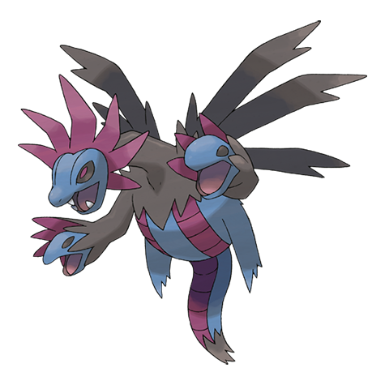

# Hydreigon (#0635)

*Brutal Pokemon*

**Type:** Buio / Drago
**Abilities:** [[Levitate]]
**Base HP:** 5

> This brutal Pokemon flies in the sky. Anything that moves seems like a foe to it, triggering its aggression. The heads on its arms do not have brains. They use all three heads to consume and destroy everything.

---

## Statistiche (Attributes & Limits)

| Attribute | Base / Limit |
|---|---|
| **Strength** | 3/6 |
| **Dexterity** | 3/6 |
| **Vitality** | 2/5 |
| **Special** | 3/7 |
| **Insight** | 2/4 |

---

## Mosse (Learnset)

- **Starter:** [[Tri_Attack|Tri Attack]], [[Dragon_Rage|Dragon Rage]]
- **Beginner:** [[Focus_Energy|Focus Energy]], [[Bite|Bite]]
- **Amateur:** [[Headbutt|Headbutt]], [[Dragon_Breath|Dragon Breath]], [[Roar|Roar]], [[Crunch|Crunch]], [[Slam|Slam]], [[Dragon_Pulse|Dragon Pulse]], [[Work_Up|Work Up]], [[Dragon_Rush|Dragon Rush]]
- **Ace:** [[Outrage|Outrage]], [[Scary_Face|Scary Face]], [[Body_Slam|Body Slam]], [[Hyper_Voice|Hyper Voice]]
- **Pro:** [[Draco_Meteor|Draco Meteor]], [[Heat_Wave|Heat Wave]], [[Earth_Power|Earth Power]]

---

## Correlati

### Catena Evolutiva
- [[0633_Deino|Deino]]
- [[0634_Zweilous|Zweilous]]
- [[0635_Hydreigon|Hydreigon]]

