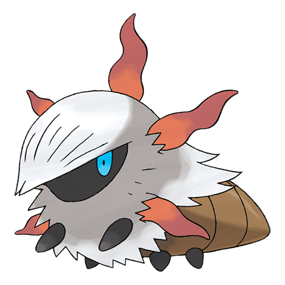

# Larvesta (#0636)

*Torch Pokemon*

**Type:** Insetto / Fuoco
**Abilities:** [[Flame Body]], [[Swarm]] *(Hidden)*
**Base HP:** 3

> Very Rare. The base of volcanoes is where they make their homes. They shoot fire from their horns to repel attacks from enemies. It becomes a flaming cocoon for months before it finally evolves.

---

## Statistiche (Attributes & Limits)

| Attribute | Base / Limit |
|---|---|
| **Strength** | 2/5 |
| **Dexterity** | 2/4 |
| **Vitality** | 2/4 |
| **Special** | 2/4 |
| **Insight** | 2/4 |

---

## Mosse (Learnset)

- **Starter:** [[Ember|Ember]], [[String_Shot|String Shot]]
- **Beginner:** [[Absorb|Absorb]]
- **Amateur:** [[Take_Down|Take Down]], [[Flame_Charge|Flame Charge]]
- **Ace:** [[Bug_Bite|Bug Bite]], [[Double_Edge|Double-Edge]], [[Flame_Wheel|Flame Wheel]], [[Bug_Buzz|Bug Buzz]], [[Amnesia|Amnesia]]
- **Pro:** [[Thrash|Thrash]], [[Flare_Blitz|Flare Blitz]], [[Harden|Harden]], [[Giga_Drain|Giga Drain]], [[Zen_Headbutt|Zen Headbutt]]

---

## Correlati

### Catena Evolutiva
- [[0636_Larvesta|Larvesta]]
- [[0637_Volcarona|Volcarona]]

