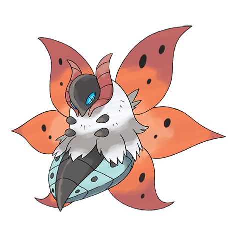

# Volcarona (#0637)

*Sun Pokemon*

**Type:** Insetto / Fuoco
**Abilities:** [[Flame Body]], [[Swarm]] *(Hidden)*
**Base HP:** 4

> A sea of fire engulfs the surroundings of its battles, since it uses six wings to scatter blazing scales. There are stories of how its fire saved villages during winter and how it shone like the sun over the mountains.

---

## Statistiche (Attributes & Limits)

| Attribute | Base / Limit |
|---|---|
| **Strength** | 2/4 |
| **Dexterity** | 3/6 |
| **Vitality** | 2/4 |
| **Special** | 3/7 |
| **Insight** | 3/6 |

---

## Mosse (Learnset)

- **Starter:** [[Ember|Ember]], [[String_Shot|String Shot]]
- **Beginner:** [[Absorb|Absorb]], [[Gust|Gust]]
- **Amateur:** [[Fire_Spin|Fire Spin]]
- **Ace:** [[Rage_Powder|Rage Powder]], [[Quiver_Dance|Quiver Dance]], [[Amnesia|Amnesia]], [[Fiery_Dance|Fiery Dance]], [[Whirlwind|Whirlwind]], [[Silver_Wind|Silver Wind]], [[Heat_Wave|Heat Wave]], [[Bug_Buzz|Bug Buzz]]
- **Pro:** [[Thrash|Thrash]], [[Hurricane|Hurricane]], [[Flare_Blitz|Flare Blitz]], [[Tailwind|Tailwind]], [[Morning_Sun|Morning Sun]], [[Magnet_Rise|Magnet Rise]]

---

## Correlati

### Catena Evolutiva
- [[0636_Larvesta|Larvesta]]
- [[0637_Volcarona|Volcarona]]

