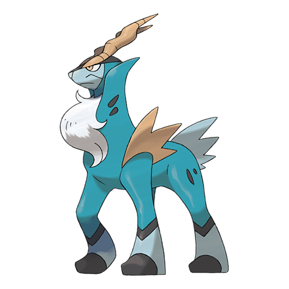

# Cobalion (#0638)

*No Data*

**Type:** Acciaio / Lotta
**Abilities:** [[Justified]]
**Base HP:** 4

> There is a story in Unova about four Pokemon that brought justice to the wrongdoers. Their Leader was calm and composed but unforgiving. Its cold stare forced you to obey its law.

---

## Statistiche (Attributes & Limits)

| Attribute | Base / Limit |
|---|---|
| **Strength** | 5/5 |
| **Dexterity** | 6/6 |
| **Vitality** | 7/7 |
| **Special** | 5/5 |
| **Insight** | 5/5 |

---

## Mosse (Learnset)

- **Master:** [[Quick_Attack|Quick Attack]], [[Leer|Leer]], [[Double_Kick|Double Kick]], [[Metal_Claw|Metal Claw]], [[Take_Down|Take Down]], [[Helping_Hand|Helping Hand]], [[Retaliate|Retaliate]], [[Iron_Head|Iron Head]], [[Sacred_Sword|Sacred Sword]], [[Swords_Dance|Swords Dance]], [[Quick_Guard|Quick Guard]], [[Work_Up|Work Up]], [[Metal_Burst|Metal Burst]], [[Close_Combat|Close Combat]], [[Psych_Up|Psych Up]], [[Calm_Mind|Calm Mind]], [[Laser_Focus|Laser Focus]]

---

