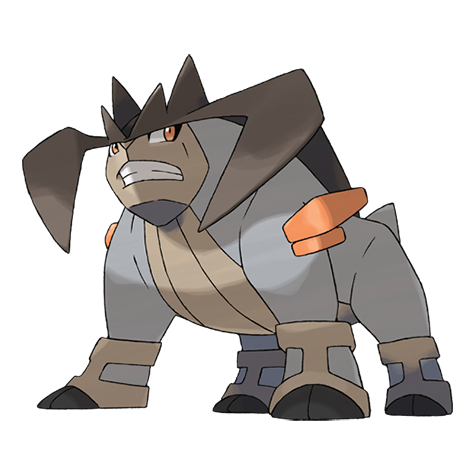

# Terrakion (#0639)

*No Data*

**Type:** Roccia / Lotta
**Abilities:** [[Justified]]
**Base HP:** 4

> Legends in Unova tell about four Pokemon that rebelled against the unfair ruler. One of them trampled through the castle walls, destroying the fortress to free the trapped Pokemon inside.

---

## Statistiche (Attributes & Limits)

| Attribute | Base / Limit |
|---|---|
| **Strength** | 7/7 |
| **Dexterity** | 6/6 |
| **Vitality** | 5/5 |
| **Special** | 5/5 |
| **Insight** | 5/5 |

---

## Mosse (Learnset)

- **Master:** [[Quick_Attack|Quick Attack]], [[Leer|Leer]], [[Double_Kick|Double Kick]], [[Smack_Down|Smack Down]], [[Safeguard|Safeguard]], [[Swift|Swift]], [[Take_Down|Take Down]], [[Helping_Hand|Helping Hand]], [[Retaliate|Retaliate]], [[Rock_Slide|Rock Slide]], [[Sacred_Sword|Sacred Sword]], [[Swords_Dance|Swords Dance]], [[Quick_Guard|Quick Guard]], [[Work_Up|Work Up]], [[Stone_Edge|Stone Edge]], [[Close_Combat|Close Combat]], [[Superpower|Superpower]], [[Giga_Impact|Giga Impact]], [[Bulldoze|Bulldoze]]

---

