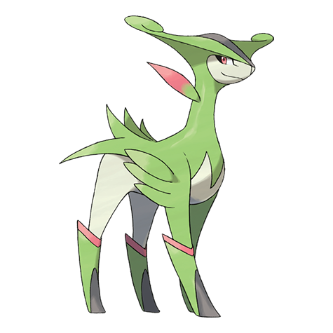

# Virizion (#0640)

*No Data*

**Type:** Erba / Lotta
**Abilities:** [[Justified]]
**Base HP:** 4

> An old tale in Unova mentions four Pokemon that fought against an evil army. The most beautiful of them was also the most swift and graceful in combat, it created an army of trees that won the battle.

---

## Statistiche (Attributes & Limits)

| Attribute | Base / Limit |
|---|---|
| **Strength** | 5/5 |
| **Dexterity** | 6/6 |
| **Vitality** | 5/5 |
| **Special** | 7/7 |
| **Insight** | 5/5 |

---

## Mosse (Learnset)

- **Master:** [[Quick_Attack|Quick Attack]], [[Leer|Leer]], [[Double_Kick|Double Kick]], [[Magical_Leaf|Magical Leaf]], [[Take_Down|Take Down]], [[Helping_Hand|Helping Hand]], [[Retaliate|Retaliate]], [[Giga_Drain|Giga Drain]], [[Sacred_Sword|Sacred Sword]], [[Swords_Dance|Swords Dance]], [[Quick_Guard|Quick Guard]], [[Work_Up|Work Up]], [[Leaf_Blade|Leaf Blade]], [[Close_Combat|Close Combat]], [[Agility|Agility]], [[Charm|Charm]], [[Attract|Attract]]

---

