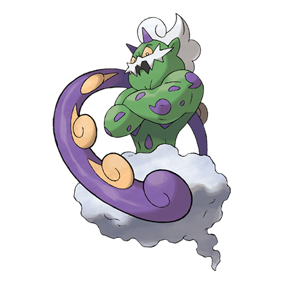

# Tornadus (#0641)

*No Data*

**Type:** Volante
**Abilities:** [[Prankster]], [[Defiant]] *(Hidden)*
**Base HP:** 4

> Unova suffers from terrible tornadoes and devastating wind currents that leave houses and buildings in ruins. Some people claim a Pokemon riding the winds is responsible for all the devastation.

---

## Statistiche (Attributes & Limits)

| Attribute | Base / Limit |
|---|---|
| **Strength** | 6/6 |
| **Dexterity** | 6/6 |
| **Vitality** | 5/5 |
| **Special** | 7/7 |
| **Insight** | 5/5 |

---

## Mosse (Learnset)

- **Master:** [[Uproar|Uproar]], [[Astonish|Astonish]], [[Gust|Gust]], [[Swagger|Swagger]], [[Bite|Bite]], [[Revenge|Revenge]], [[Air_Cutter|Air Cutter]], [[Extrasensory|Extrasensory]], [[Agility|Agility]], [[Air_Slash|Air Slash]], [[Crunch|Crunch]], [[Tailwind|Tailwind]], [[Rain_Dance|Rain Dance]], [[Hurricane|Hurricane]], [[Dark_Pulse|Dark Pulse]], [[Hammer_Arm|Hammer Arm]], [[Thrash|Thrash]], [[Whirlwind|Whirlwind]], [[Defog|Defog]]

---

## Correlati

### Catena Evolutiva
- [[0641_Tornadus|Tornadus]]
- Tornadus (Therian Form)

---

## Tornadus (Forma Totem) (#0641F1)

**Type:** Volante
**Abilities:** [[Regenerator]]
**Base HP:** 4

| Attribute | Base / Limit |
|---|---|
| **Strength** | 6/6 |
| **Dexterity** | 7/7 |
| **Vitality** | 5/5 |
| **Special** | 6/6 |
| **Insight** | 5/5 |

### Mosse

- **Master:** [[Uproar|Uproar]], [[Astonish|Astonish]], [[Gust|Gust]], [[Swagger|Swagger]], [[Bite|Bite]], [[Revenge|Revenge]], [[Air_Cutter|Air Cutter]], [[Extrasensory|Extrasensory]], [[Agility|Agility]], [[Air_Slash|Air Slash]], [[Crunch|Crunch]], [[Tailwind|Tailwind]], [[Rain_Dance|Rain Dance]], [[Hurricane|Hurricane]], [[Dark_Pulse|Dark Pulse]], [[Hammer_Arm|Hammer Arm]], [[Thrash|Thrash]], [[Whirlwind|Whirlwind]], [[Defog|Defog]]

