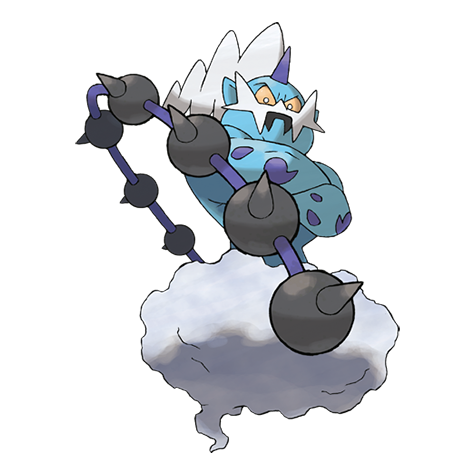

# Thundurus (#0642)

*No Data*

**Type:** Elettro / Volante
**Abilities:** [[Prankster]], [[Defiant]] *(Hidden)*
**Base HP:** 4

> There are constant forest fires all through the Unova region. These fires are always the result of a giant thunder storm. Forest rangers tell about a blue demon’s shadow that was inside the storm clouds.

---

## Statistiche (Attributes & Limits)

| Attribute | Base / Limit |
|---|---|
| **Strength** | 6/6 |
| **Dexterity** | 6/6 |
| **Vitality** | 5/5 |
| **Special** | 7/7 |
| **Insight** | 5/5 |

---

## Mosse (Learnset)

- **Master:** [[Uproar|Uproar]], [[Astonish|Astonish]], [[Thunder_Shock|Thunder Shock]], [[Swagger|Swagger]], [[Bite|Bite]], [[Revenge|Revenge]], [[Shock_Wave|Shock Wave]], [[Heal_Block|Heal Block]], [[Agility|Agility]], [[Discharge|Discharge]], [[Crunch|Crunch]], [[Charge|Charge]], [[Nasty_Plot|Nasty Plot]], [[Thunder|Thunder]], [[Dark_Pulse|Dark Pulse]], [[Hammer_Arm|Hammer Arm]], [[Thrash|Thrash]], [[Ion_Deluge|Ion Deluge]], [[Electric_Terrain|Electric Terrain]]

---

## Correlati

### Catena Evolutiva
- [[0642_Thundurus|Thundurus]]
- Thundurus (Therian Form)

---

## Thundurus (Forma Totem) (#0642F1)

**Type:** Elettro / Volante
**Abilities:** [[Prankster]], [[Defiant]] *(Hidden)*
**Base HP:** 4

| Attribute | Base / Limit |
|---|---|
| **Strength** | 6/6 |
| **Dexterity** | 6/6 |
| **Vitality** | 5/5 |
| **Special** | 8/8 |
| **Insight** | 5/5 |

### Mosse

- **Master:** [[Uproar|Uproar]], [[Astonish|Astonish]], [[Thunder_Shock|Thunder Shock]], [[Swagger|Swagger]], [[Bite|Bite]], [[Revenge|Revenge]], [[Shock_Wave|Shock Wave]], [[Heal_Block|Heal Block]], [[Agility|Agility]], [[Discharge|Discharge]], [[Crunch|Crunch]], [[Charge|Charge]], [[Nasty_Plot|Nasty Plot]], [[Thunder|Thunder]], [[Dark_Pulse|Dark Pulse]], [[Hammer_Arm|Hammer Arm]], [[Thrash|Thrash]], [[Ion_Deluge|Ion Deluge]], [[Electric_Terrain|Electric Terrain]]

