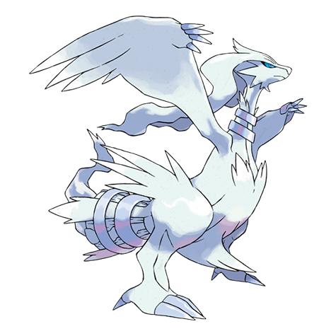

# Reshiram (#0643)

*No Data*

**Type:** Drago / Fuoco
**Abilities:** [[Turboblaze]]
**Base HP:** 5

> An Incredibly old scroll written in an ancient language, tells about a world of truth built by purifying fire. It also tells about a big dispute. The rest of the scroll is burned…

---

## Statistiche (Attributes & Limits)

| Attribute | Base / Limit |
|---|---|
| **Strength** | 7/7 |
| **Dexterity** | 5/5 |
| **Vitality** | 6/6 |
| **Special** | 8/8 |
| **Insight** | 7/7 |

---

## Mosse (Learnset)

- **Master:** [[Dragon_Rage|Dragon Rage]], [[Fire_Fang|Fire Fang]], [[Imprison|Imprison]], [[Ancient_Power|Ancient Power]], [[Flamethrower|Flamethrower]], [[Dragon_Breath|Dragon Breath]], [[Slash|Slash]], [[Extrasensory|Extrasensory]], [[Fusion_Flare|Fusion Flare]], [[Dragon_Pulse|Dragon Pulse]], [[Noble_Roar|Noble Roar]], [[Crunch|Crunch]], [[Fire_Blast|Fire Blast]], [[Outrage|Outrage]], [[Hyper_Voice|Hyper Voice]], [[Blue_Flare|Blue Flare]], [[Lucky_Chant|Lucky Chant]], [[Wish|Wish]], [[Fire_Pledge|Fire Pledge]], [[Topsy_Turvy|Topsy-Turvy]]

---

