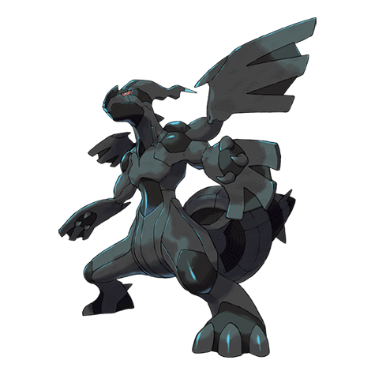

# Zekrom (#0644)

*No Data*

**Type:** Drago / Elettro
**Abilities:** [[Teravolt]]
**Base HP:** 5

> An old rock tablet full of ancient symbols tells the story of two brothers. One of them wanted a world of ideals built with the energy of the young. The rest of the stone is broken as if struck by lightning.

---

## Statistiche (Attributes & Limits)

| Attribute | Base / Limit |
|---|---|
| **Strength** | 8/8 |
| **Dexterity** | 5/5 |
| **Vitality** | 7/7 |
| **Special** | 7/7 |
| **Insight** | 6/6 |

---

## Mosse (Learnset)

- **Master:** [[Dragon_Rage|Dragon Rage]], [[Thunder_Fang|Thunder Fang]], [[Imprison|Imprison]], [[Ancient_Power|Ancient Power]], [[Thunderbolt|Thunderbolt]], [[Dragon_Breath|Dragon Breath]], [[Slash|Slash]], [[Zen_Headbutt|Zen Headbutt]], [[Fusion_Bolt|Fusion Bolt]], [[Dragon_Claw|Dragon Claw]], [[Noble_Roar|Noble Roar]], [[Crunch|Crunch]], [[Thunder|Thunder]], [[Outrage|Outrage]], [[Hyper_Voice|Hyper Voice]], [[Bolt_Strike|Bolt Strike]], [[Lucky_Chant|Lucky Chant]], [[Wish|Wish]], [[Future_Sight|Future Sight]], [[Topsy_Turvy|Topsy-Turvy]]

---

