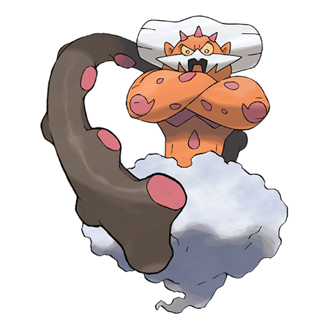

# Landorus (#0645)

*No Data*

**Type:** Terra / Volante
**Abilities:** [[Sand Force]], [[Sheer Force]] *(Hidden)*
**Base HP:** 4

> Earthquakes and landslides raze Unova with frequency, but the places who suffer them are left with a plentiful harvest that year. Feared by some, revered by others who claim to have seen it.

---

## Statistiche (Attributes & Limits)

| Attribute | Base / Limit |
|---|---|
| **Strength** | 7/7 |
| **Dexterity** | 6/6 |
| **Vitality** | 5/5 |
| **Special** | 6/6 |
| **Insight** | 5/5 |

---

## Mosse (Learnset)

- **Master:** [[Block|Block]], [[Mud_Shot|Mud Shot]], [[Rock_Tomb|Rock Tomb]], [[Imprison|Imprison]], [[Punishment|Punishment]], [[Bulldoze|Bulldoze]], [[Rock_Throw|Rock Throw]], [[Extrasensory|Extrasensory]], [[Swords_Dance|Swords Dance]], [[Earth_Power|Earth Power]], [[Rock_Slide|Rock Slide]], [[Earthquake|Earthquake]], [[Sandstorm|Sandstorm]], [[Fissure|Fissure]], [[Stone_Edge|Stone Edge]], [[Hammer_Arm|Hammer Arm]], [[Outrage|Outrage]], [[Rototiller|Rototiller]], [[Dig|Dig]]

---

## Correlati

### Catena Evolutiva
- [[0645_Landorus|Landorus]]
- Landorus (Therian Form)

---

## Landorus (Forma Totem) (#0645F1)

**Type:** Terra / Volante
**Abilities:** [[Sand Force]], [[Sheer Force]] *(Hidden)*
**Base HP:** 4

| Attribute | Base / Limit |
|---|---|
| **Strength** | 8/8 |
| **Dexterity** | 5/5 |
| **Vitality** | 5/5 |
| **Special** | 6/6 |
| **Insight** | 5/5 |

### Mosse

- **Master:** [[Block|Block]], [[Mud_Shot|Mud Shot]], [[Rock_Tomb|Rock Tomb]], [[Imprison|Imprison]], [[Punishment|Punishment]], [[Bulldoze|Bulldoze]], [[Rock_Throw|Rock Throw]], [[Extrasensory|Extrasensory]], [[Swords_Dance|Swords Dance]], [[Earth_Power|Earth Power]], [[Rock_Slide|Rock Slide]], [[Earthquake|Earthquake]], [[Sandstorm|Sandstorm]], [[Fissure|Fissure]], [[Stone_Edge|Stone Edge]], [[Hammer_Arm|Hammer Arm]], [[Outrage|Outrage]], [[Rototiller|Rototiller]], [[Dig|Dig]]

