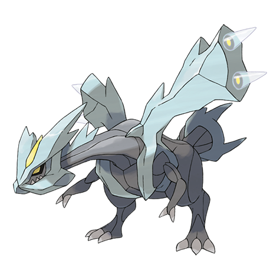

# Kyurem (#0646)

*No Data*

**Type:** Drago / Ghiaccio
**Abilities:** [[Pressure]]
**Base HP:** 6

> Inside a remote and frozen cave there are some old paintings. They depict a giant dragon being thorn apart into a black and white shards Of the rest of the picture only shattered fragments of ice remain.

---

## Statistiche (Attributes & Limits)

| Attribute | Base / Limit |
|---|---|
| **Strength** | 7/7 |
| **Dexterity** | 6/6 |
| **Vitality** | 5/5 |
| **Special** | 7/7 |
| **Insight** | 5/5 |

---

## Mosse (Learnset)

- **Master:** [[Icy_Wind|Icy Wind]], [[Dragon_Rage|Dragon Rage]], [[Imprison|Imprison]], [[Ancient_Power|Ancient Power]], [[Ice_Beam|Ice Beam]], [[Dragon_Breath|Dragon Breath]], [[Slash|Slash]], [[Scary_Face|Scary Face]], [[Glaciate|Glaciate]], [[Dragon_Pulse|Dragon Pulse]], [[Noble_Roar|Noble Roar]], [[Endeavor|Endeavor]], [[Blizzard|Blizzard]], [[Outrage|Outrage]], [[Hyper_Voice|Hyper Voice]], [[Substitute|Substitute]], [[Hail|Hail]], [[Haze|Haze]], [[Mist|Mist]], [[Recover|Recover]], [[Sheer_Cold|Sheer Cold]], [[Power_Split|Power Split]]

---

## Correlati

### Catena Evolutiva
- [[0646_Kyurem|Kyurem]]
- Kyurem (Black Form)
- Kyurem (White Form)

---

## Kyurem Nero (#0646F1)

**Type:** Drago / Ghiaccio
**Abilities:** [[Pressure]]
**Base HP:** 6

| Attribute | Base / Limit |
|---|---|
| **Strength** | 9/9 |
| **Dexterity** | 6/6 |
| **Vitality** | 6/6 |
| **Special** | 7/7 |
| **Insight** | 5/5 |

### Mosse

- **Master:** [[Icy_Wind|Icy Wind]], [[Dragon_Rage|Dragon Rage]], [[Imprison|Imprison]], [[Ancient_Power|Ancient Power]], [[Ice_Beam|Ice Beam]], [[Dragon_Breath|Dragon Breath]], [[Slash|Slash]], [[Scary_Face|Scary Face]], [[Glaciate|Glaciate]], [[Dragon_Pulse|Dragon Pulse]], [[Noble_Roar|Noble Roar]], [[Endeavor|Endeavor]], [[Blizzard|Blizzard]], [[Outrage|Outrage]], [[Hyper_Voice|Hyper Voice]], [[Topsy_Turvy|Topsy-Turvy]], [[Future_Sight|Future Sight]], [[Punishment|Punishment]], [[Wish|Wish]], [[Recover|Recover]], [[Fusion_Bolt|Fusion Bolt]], [[Bolt_Strike|Bolt Strike]]

---

## Kyurem Bianco (#0646F2)

**Type:** Drago / Ghiaccio
**Abilities:** [[Pressure]]
**Base HP:** 6

| Attribute | Base / Limit |
|---|---|
| **Strength** | 7/7 |
| **Dexterity** | 6/6 |
| **Vitality** | 5/5 |
| **Special** | 9/9 |
| **Insight** | 6/6 |

### Mosse

- **Master:** [[Icy_Wind|Icy Wind]], [[Dragon_Rage|Dragon Rage]], [[Imprison|Imprison]], [[Ancient_Power|Ancient Power]], [[Ice_Beam|Ice Beam]], [[Dragon_Breath|Dragon Breath]], [[Slash|Slash]], [[Scary_Face|Scary Face]], [[Glaciate|Glaciate]], [[Dragon_Pulse|Dragon Pulse]], [[Noble_Roar|Noble Roar]], [[Endeavor|Endeavor]], [[Blizzard|Blizzard]], [[Outrage|Outrage]], [[Hyper_Voice|Hyper Voice]], [[Topsy_Turvy|Topsy-Turvy]], [[Lucky_Chant|Lucky Chant]], [[Punishment|Punishment]], [[Wish|Wish]], [[Recover|Recover]], [[Fusion_Flare|Fusion Flare]], [[Blue_Flare|Blue Flare]]

