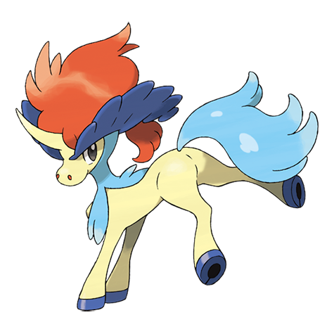

# Keldeo (#0647)

*No Data*

**Type:** Acqua / Lotta
**Abilities:** [[Justified]]
**Base HP:** 4

> Age-old fairy tales of Unova tell the story of four Pokemon that brought the land to a golden age. The young of the group was brave and naive. It could gallop on the water surface leaving a rainbow behind.

---

## Statistiche (Attributes & Limits)

| Attribute | Base / Limit |
|---|---|
| **Strength** | 5/5 |
| **Dexterity** | 6/6 |
| **Vitality** | 5/5 |
| **Special** | 7/7 |
| **Insight** | 5/5 |

---

## Mosse (Learnset)

- **Master:** [[Aqua_Jet|Aqua Jet]], [[Leer|Leer]], [[Double_Kick|Double Kick]], [[Bubble_Beam|Bubble Beam]], [[Take_Down|Take Down]], [[Helping_Hand|Helping Hand]], [[Retaliate|Retaliate]], [[Aqua_Tail|Aqua Tail]], [[Sacred_Sword|Sacred Sword]], [[Swords_Dance|Swords Dance]], [[Quick_Guard|Quick Guard]], [[Work_Up|Work Up]], [[Hydro_Pump|Hydro Pump]], [[Close_Combat|Close Combat]], [[Surf|Surf]], [[Waterfall|Waterfall]], [[Follow_Me|Follow Me]], [[Noble_Roar|Noble Roar]]

---

## Correlati

### Catena Evolutiva
- [[0647_Keldeo|Keldeo]]
- Keldeo (Resolute Form)

---

## Keldeo (Forma Risoluta) (#0647F1)

**Type:** Acqua / Lotta
**Abilities:** [[Justified]]
**Base HP:** 4

| Attribute | Base / Limit |
|---|---|
| **Strength** | 6/6 |
| **Dexterity** | 6/6 |
| **Vitality** | 6/6 |
| **Special** | 7/7 |
| **Insight** | 5/5 |

### Mosse

- **Master:** [[Aqua_Jet|Aqua Jet]], [[Leer|Leer]], [[Double_Kick|Double Kick]], [[Bubble_Beam|Bubble Beam]], [[Take_Down|Take Down]], [[Helping_Hand|Helping Hand]], [[Retaliate|Retaliate]], [[Aqua_Tail|Aqua Tail]], [[Sacred_Sword|Sacred Sword]], [[Swords_Dance|Swords Dance]], [[Quick_Guard|Quick Guard]], [[Work_Up|Work Up]], [[Hydro_Pump|Hydro Pump]], [[Close_Combat|Close Combat]], [[Surf|Surf]], [[Waterfall|Waterfall]], [[Follow_Me|Follow Me]], [[Noble_Roar|Noble Roar]]

