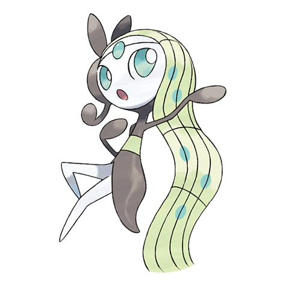

# Meloetta (#0648)

*No Data*

**Type:** Normale / Psico
**Abilities:** [[Serene Grace]]
**Base HP:** 5

> There are old songs about a beautiful Pokemon that inspired the hearts of artists through its graceful dance and singing.

---

## Statistiche (Attributes & Limits)

| Attribute | Base / Limit |
|---|---|
| **Strength** | 5/5 |
| **Dexterity** | 5/5 |
| **Vitality** | 5/5 |
| **Special** | 7/7 |
| **Insight** | 7/7 |

---

## Mosse (Learnset)

- **Master:** [[Psychic|Psychic]], [[Round|Round]], [[Quick_Attack|Quick Attack]], [[Confusion|Confusion]], [[Sing|Sing]], [[Teeter_Dance|Teeter Dance]], [[Acrobatics|Acrobatics]], [[Psybeam|Psybeam]], [[Echoed_Voice|Echoed Voice]], [[U_Turn|U-Turn]], [[Psychic|Psychic]], [[Hyper_Voice|Hyper Voice]], [[Role_Play|Role Play]], [[Close_Combat|Close Combat]], [[Perish_Song|Perish Song]], [[Boomburst|Boomburst]], [[Disarming_Voice|Disarming Voice]], [[Lucky_Chant|Lucky Chant]], [[Relic_Song|Relic Song]], [[Captivate|Captivate]]

---

## Correlati

### Catena Evolutiva
- [[0648_Meloetta|Meloetta]]
- Meloetta (Pirouette Form)

---

## Meloetta (Forma Piroetta) (#0648F1)

**Type:** Normale / Lotta
**Abilities:** [[Serene Grace]]
**Base HP:** 5

| Attribute | Base / Limit |
|---|---|
| **Strength** | 7/7 |
| **Dexterity** | 7/7 |
| **Vitality** | 5/5 |
| **Special** | 5/5 |
| **Insight** | 5/5 |

### Mosse

- **Master:** [[Round|Round]], [[Quick_Attack|Quick Attack]], [[Confusion|Confusion]], [[Sing|Sing]], [[Teeter_Dance|Teeter Dance]], [[Acrobatics|Acrobatics]], [[Psybeam|Psybeam]], [[Echoed_Voice|Echoed Voice]], [[U_Turn|U-Turn]], [[Psychic|Psychic]], [[Hyper_Voice|Hyper Voice]], [[Role_Play|Role Play]], [[Close_Combat|Close Combat]], [[Perish_Song|Perish Song]], [[Entrainment|Entrainment]], [[Swords_Dance|Swords Dance]], [[Revelation_Dance|Revelation Dance]], [[Rapid_Spin|Rapid Spin]], [[Captivate|Captivate]]

