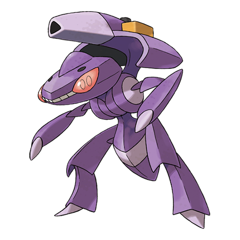

# Genesect (#0649)

*No Data*

**Type:** Insetto / Acciaio
**Abilities:** [[Download]]
**Base HP:** 4

> Fossil revival is now possible with our incredible technology. Recently, some researchers sparked a controversial debate by altering the original forms of the revived Pokemon through artificial means.

---

## Statistiche (Attributes & Limits)

| Attribute | Base / Limit |
|---|---|
| **Strength** | 7/7 |
| **Dexterity** | 6/6 |
| **Vitality** | 6/6 |
| **Special** | 7/7 |
| **Insight** | 6/6 |

---

## Mosse (Learnset)

- **Master:** [[Fell_Stinger|Fell Stinger]], [[Techno_Blast|Techno Blast]], [[Quick_Attack|Quick Attack]], [[Magnet_Rise|Magnet Rise]], [[Metal_Claw|Metal Claw]], [[Screech|Screech]], [[Fury_Cutter|Fury Cutter]], [[Lock_On|Lock-On]], [[Flame_Charge|Flame Charge]], [[Magnet_Bomb|Magnet Bomb]], [[Slash|Slash]], [[Metal_Sound|Metal Sound]], [[Signal_Beam|Signal Beam]], [[Tri_Attack|Tri Attack]], [[X_Scissor|X-Scissor]], [[Bug_Buzz|Bug Buzz]], [[Simple_Beam|Simple Beam]], [[Zap_Cannon|Zap Cannon]], [[Hyper_Beam|Hyper Beam]], [[Self_Destruct|Self Destruct]], [[Flash_Cannon|Flash Cannon]], [[Bullet_Seed|Bullet Seed]]

---

