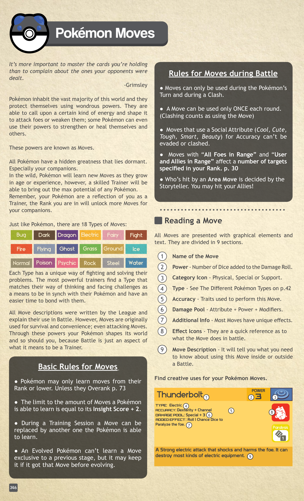
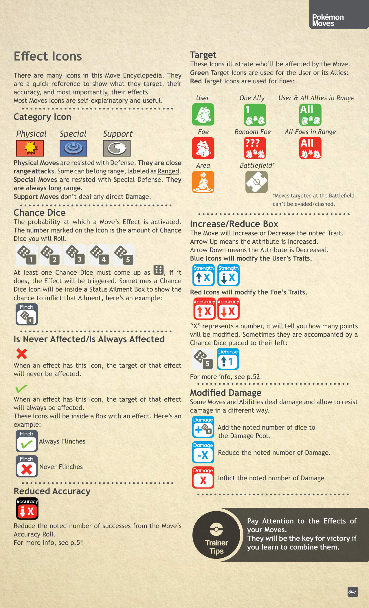
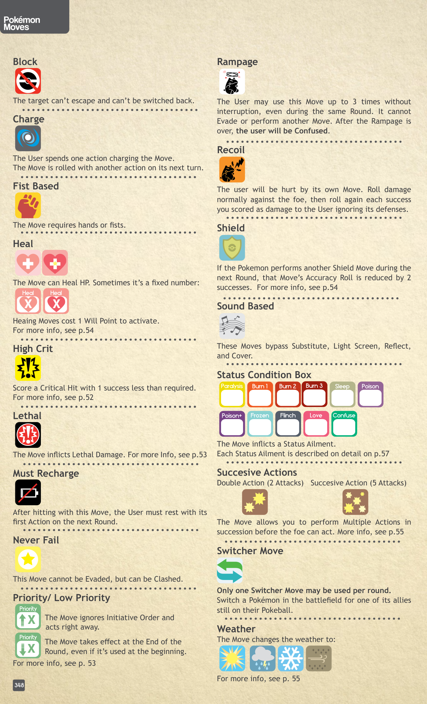

# Introduzione alle Moves

## Descrizione Generale

I Pokémon in natura imparano le Mosse crescendo in età ed esperienza, ma un abile Allenatore sa tirare fuori il massimo potenziale dai propri compagni. Proprio come per i Pokémon, esistono **18 Tipi di Mosse**, ognuno con un approccio unico al combattimento.

> 💡 *Trovare il Tipo che si adatta meglio alla mentalità del tuo Allenatore aiuta a entrare in sintonia con i Pokémon.*

Sebbene le descrizioni delle mosse siano state scritte dalla Lega per regolamentare le lotte, ricorda che in natura le Mosse sono usate per **sopravvivenza e comodità**. Sii creativo: usa *Thunderbolt* per alimentare un generatore o *Ice Beam* per congelare un fiume.

---

## Regole Base per le Mosse

| Regola | Dettaglio |
|---|---|
| **Limite Equipaggiate** | Un Pokémon può conoscere un numero di mosse massimo pari a **Insight + 2**. |
| **Rank** | I Pokémon possono imparare solo Mosse del loro **Rank o inferiore** (a meno di usare l'[[Allenare_Pokemon\|Overank]]). |
| **Sostituzione** | Le mosse possono essere cambiate con altre mosse compatibili durante una **Training Session**. |
| **Evoluzione** | Un Pokémon evoluto non può imparare nuove mosse esclusive del suo stadio precedente, ma se le aveva imparate prima di evolversi può mantenerle. |

### Regole d'Uso in Battaglia

> ⚠️ **Limiti di Utilizzo:** Una Mossa può essere usata **solo UNA volta per Round**. (Usarla per eseguire un [[Strategie_di_Combattimento\|Clash]] conta come utilizzo).

| Meccanica | Dettaglio |
|---|---|
| **Turno** | Le mosse si usano solo durante il Turno del Pokémon o in risposta a un attacco tramite Clash. |
| **Mosse Sociali** | Le Mosse che usano un *Social Attribute* per il tiro di Accuracy (*Cool, Cute, Tough, Clever, Beauty*) **non possono essere evase o clascate**, poiché colpiscono la mente e le emozioni. |
| **Mosse ad Area** | Le mosse "All Foes in Range" e "User and Allies" colpiscono un numero di bersagli che scala in base al Rank (vedi [[Ranking]]). |
| **Fuoco Amico** | Lo Storyteller decide l'esatto posizionamento e chi viene colpito da una mossa ad Area: **puoi finire per colpire i tuoi alleati!** |

---

## Come Leggere una Mossa

Il manuale utilizza una codifica visiva standardizzata per ogni mossa, in modo da riassumerne gli effetti meccanici a colpo d'occhio.

1. **Nome della Mossa**
2. **Power:** Il numero di dadi aggiunti al *Damage Roll*.
3. **Category Icon:** Indica se è Fisica, Speciale o di Supporto.
4. **Type:** Il Tipo elementale della Mossa.
5. **Accuracy:** Gli attributi e le skill usate per la Dice Pool per colpire (es. *Dexterity + Channel*).
6. **Damage Pool:** La formula del danno, solitamente *Strength/Special + Power*.
7. **Additional Info:** Eventuali note ed effetti passivi unici.
8. **Effect Icons:** Icone rapide degli effetti attivati (es. dadi probabilità per Paralisi).
9. **Move Description:** La spiegazione narrativa di cosa fa la mossa e delle sue regole extra.

---

## Categorie e Modificatori

Esistono tre grandi Categorie di Mosse:
- **Physical (Fisiche):** Sono resistite dalla *Defense* (Vitality). Solitamente a corto raggio.
- **Special (Speciali):** Sono resistite dalla *Special Defense* (Insight). Sono sempre a lungo raggio.
- **Support (Supporto):** Non infliggono danni diretti. Alterano statistiche o condizioni.

### Modificatori Statistiche e Danni
- Le icone **Blu** modificano le statistiche dell'User (es. *Defense +1*).
- Le icone **Rosse** modificano le statistiche del Foe (es. *Accuracy -1*).
- **Damage +X / -X:** Aggiunge o sottrae il numero indicato di dadi dalla *Damage Pool*.
- **Damage X:** Infligge danni fissi diretti.

---

## Bersagli (Targets)

Di seguito l'elenco dei bersagli validi:
- **User:** L'utilizzatore stesso.
- **One Ally:** Un alleato singolo.
- **User & All Allies in Range:** Tutti gli alleati e se stessi.
- **Foe:** Un singolo nemico.
- **Random Foe:** Un nemico casuale.
- **All Foes in Range:** Tutti i nemici a portata (il numero dipende dal tuo *Rank*).
- **Area:** Tutti nell'area d'effetto (inclusi gli alleati se colpiti per sbaglio!).
- **Battlefield:** Il campo di battaglia. > ⚠️ **Attenzione:** *Le mosse Battlefield non possono essere evase o clascate.*

---

## Effetti Extra e Condizioni

Il sistema di Pokérole abbonda di effetti secondari. Ecco la traduzione completa delle icone Effetto:

- **Chance Dice:** Si tirano a parte per vedere se l'effetto si applica. Basta **un solo successo** sui dadi aggiuntivi per innescare l'effetto secondario (es. *Paralysis*).
- **Heal:** Le mosse curative richiedono sempre di spendere **1 Will Point** per essere attivate.
- **Block:** Il bersaglio non può fuggire né essere sostituito.
- **Charge:** Richiede un'azione per caricare la mossa e si lancia nel turno successivo.
- **Fist Based:** La mossa richiede l'uso di mani o pugni.
- **High Crit:** Mette a segno un *Critical Hit* richiedendo 1 successo in meno del normale.
- **Lethal:** Infligge Danni Letali (*Lethal Damage*).
- **Must Recharge:** Dopo aver colpito, l'User deve riposare durante la sua prima azione del Round successivo.
- **Never Fail:** La mossa **non può essere evasa**, ma può subire un *Clash*.
- **Priority / Low Priority:** Le mosse con *Priority* alta ignorano l'iniziativa e agiscono subito. Quelle a bassa priorità agiscono sempre alla fine del round.
- **Rampage:** Può essere usata fino a 3 volte nello stesso Round, ma l'User non può evadere e, alla fine della furia, sarà *Confused*.
- **Recoil:** L'User subisce danni dalla propria mossa. Ogni successo del danno inflitto viene tirato di nuovo come danno diretto all'User.
- **Shield:** Se si usa una mossa scudo consecutivamente, la sua *Accuracy* subisce un malus di 2 dadi al secondo utilizzo.
- **Sound Based:** Queste mosse ignorano barriere come *Substitute, Light Screen, Reflect*.
- **Successive Actions:** Mosse che permettono colpi multipli (2 o 5) prima che il nemico possa reagire.
- **Switcher Move:** Sostituisce un Pokémon in campo con uno in panchina (max 1 a round).
- **Weather:** Cambia il clima sul campo di battaglia.
- **Status Condition Box:** Indica che la mossa infligge uno stato alterato (*Burn, Freeze, Poison, Sleep, Confusion, Paralysis, Flinch, Infatuation*).

---

## Correlati

- [[Come_Funziona_il_Combattimento]] — L'ordine del turno e l'utilizzo delle mosse (Accuracy e Damage)
- [[Strategie_di_Combattimento]] — La meccanica del Clash e le Priority Moves
- [[Attributes_e_Skills]] — La differenza tra usare *Strength* per mosse fisiche e *Special* per le speciali
- [[Status_Conditions]] — Cosa significano le icone di *Paralysis*, *Poison*, *Sleep*, ecc.
- [[Meteo_e_Scenario]] — Come cambiano gli effetti delle mosse a seconda del clima (Weather icon)
- [[Ranking]] — Il numero massimo di bersagli per le Mosse ad Area basato sull'esperienza dell'Allenatore
